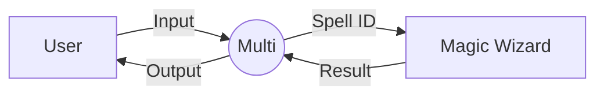
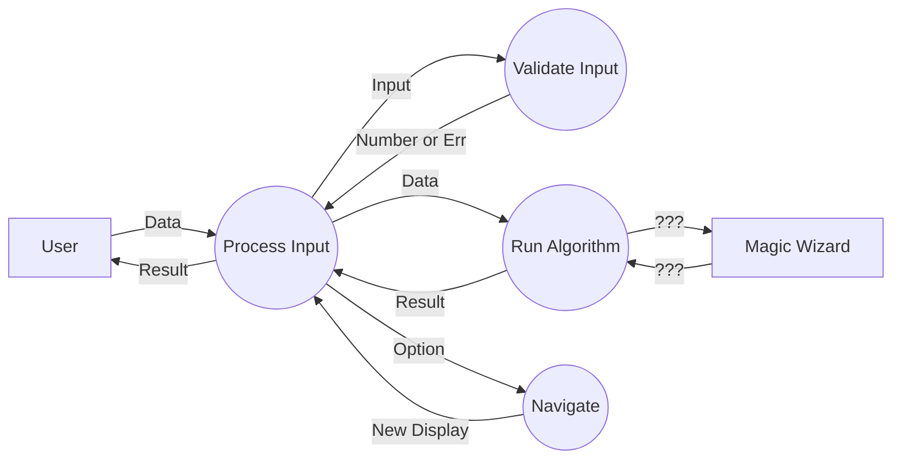
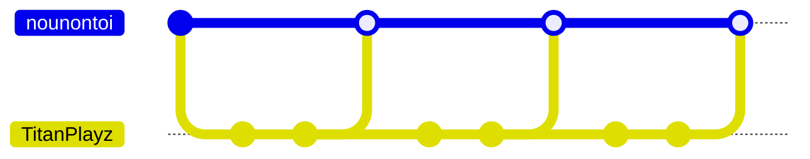
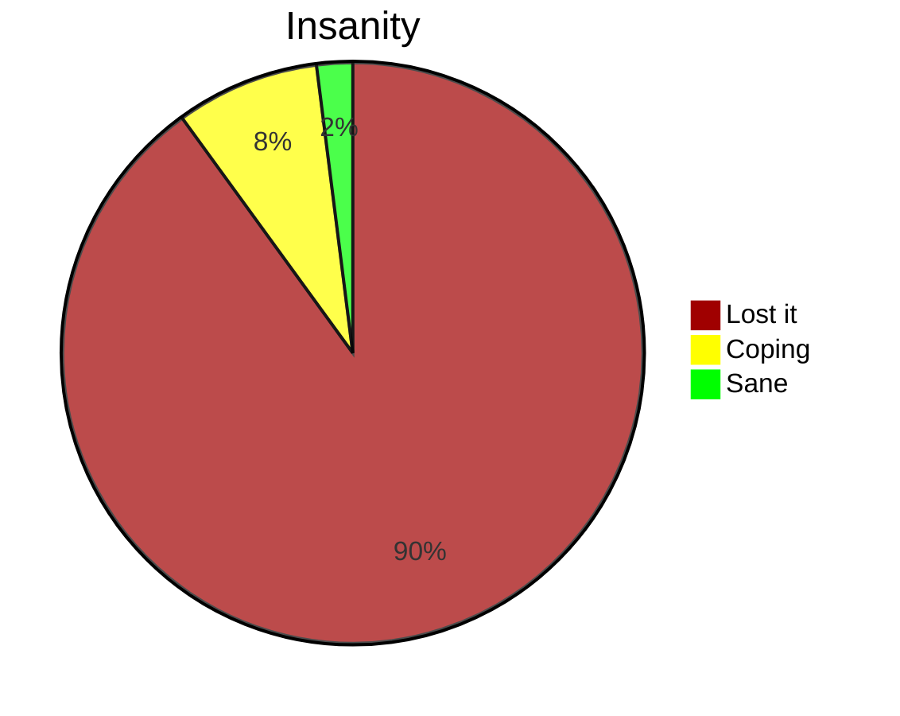

# Multi
Do you trust my code? (Don't worry, it's not a virus. It's just *incredibly* useless.)

> This is an inside joke that somehow turned into this "project".

## Compiling 

> You need the dotnet framework installed.

### Set compiler environment variable
1. Go to `C:\Windows\Microsoft.NET\Framework\` then the latest release.
2. Copy the path e.g. `C:\Windows\Microsoft.NET\Framework\v4.0.30319`.
3. Search "env" and open `Edit the system environment variables`.
4. Click `Environment Variables...`.
5. Under `User variables for [User]`, select `Path`, then `Edit`.
6. Click `New` and paste the path.
7. Click `OK` to all prompts.

> Test by typing `csc` in a new terminal.

### To compile and run
1. Go to project and run `compile.bat`.
> Alternatively, you can run `.\compile.bat` in your terminal (confirm that you are in the correct directory).
2. This creates `Multi.exe`.

## Documentation

### Developer Documentation

#### Context Diagram

#### Social and Ethical Issues
- No copyright issues :)
- No stealing from places :)
- Ergonomic and intuitive :)
- I think AI write 95% of the code :(

#### Data Flow Diagram

#### Version control

#### Developer Wellbeing

### User Documentation

#### Minimum hardware requirements
Windows 12 or Arch Linux (no Mac, iOS, Android, Samsung 651L Family Hub™ Smart Refrigerator, etc...).

#### Installation Guide
> To make room for the program, the user may choose to remove System32 from their computer.
1. If the user is running a Samsung 651L Family Hub™ Smart Refrigerator, they must first obtain a Windows 12 or Arch Linux computer through ethical or unethical means.

#### Quality Assurance
Correctness: Does it do what it is supposed to do?

Reliability: Does it do it all of the time?

Efficiency: Does it do it the best way possible?

Integrity: Is it secure?

Useability: Is it designed for the end user?

Maintainability: Can it be understood?

Flexibility: Can it be modified?

Testability: Can it be tested?

Portability: Will it work with other hardware?

Re-useability: Can parts of it be used in another project?

Interoperability: Will it work with other software?

