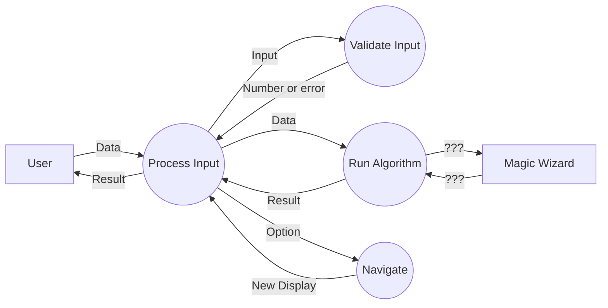
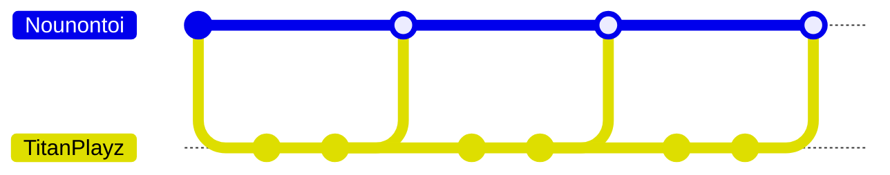
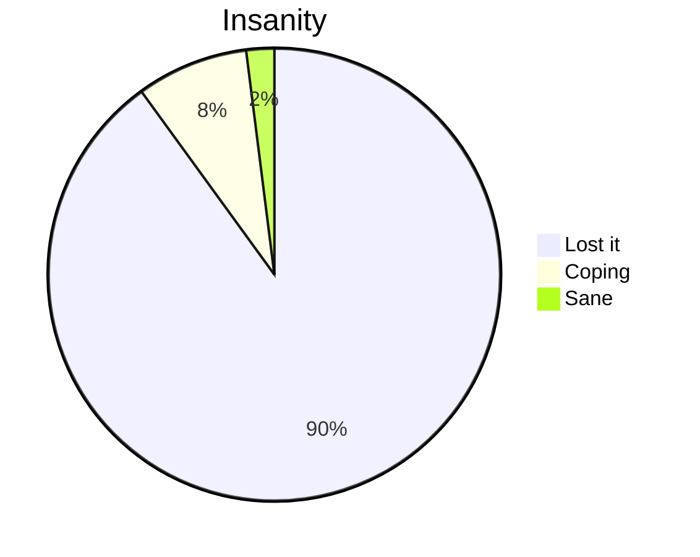

# Multi
Do you trust my code? (Don't worry, it's not a virus. It's just *incredibly* useless.)

> This is an inside joke that somehow turned into this "project".

## Compiling 

> You need the dotnet framework installed.

### Set compiler environment variable
1. Go to `C:\Windows\Microsoft.NET\Framework\` then the latest release.
2. Copy the path e.g. `C:\Windows\Microsoft.NET\Framework\v4.0.30319`.
3. Search "env" and open `Edit the system environment variables`.
4. Click `Environment Variables...`.
5. Under `User variables for [User]`, select `Path`, then `Edit`.
6. Click `New` and paste the path.
7. Click `OK` to all prompts.

> Test by typing `csc` in a new terminal.

### To compile and run
1. Go to project and run `compile.bat`.
> Alternatively, you can run `.\compile.bat` in your terminal (confirm that you are in the correct directory).
2. This creates `Multi.exe`.


## Project Documentation

### Context Diagram
```mermaid
flowchart LR
    A[User]
    B((Multi))
    C[Magic Wizard]

    A -- Input --> B -- Output --> A
    B -- Spell ID --> C Result --> B
```

### Social and Ethical Issues
- No copyright issues :)
- No stealing from places :)
- Ergonomic and intuitive :)
- I think AI write 95% of the code :(

### Data Flow Diagram


### Version control


### Developer Wellbeing


### User Guide
<- TODO ->

#### Minimum hardware requirements
Windows 12 or Arch Linux (no mac, ios, android, smart fridge, etc...)

### Quality Assurance
<- TODO ->